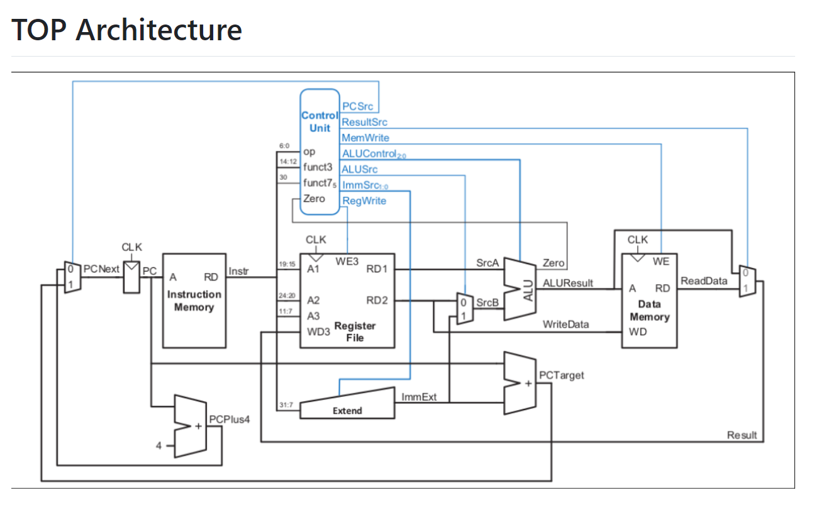

This repository contains the design files of a RISC-V Single-Cycle Core, created using the reference book *Harris D. Digital Design and Computer Architecture: RISC-V Edition ..*.

## Project Overview

In this project, I designed and implemented a single-cycle microarchitecture for the RISC-V instruction set architecture (ISA) using Verilog HDL. The focus was on developing a functional RISC-V processor capable of executing all RV32I base integer instructions in a single clock cycle. The project involved extensive research into the RISC-V ISA, the design of key components like the Arithmetic Logic Unit (ALU) and Control Unit, and the development of the necessary datapaths and state elements. The design was rigorously tested and verified using simulation tools to ensure correctness and performance.

## Key Responsibilities and Accomplishments

### RISC-V Instruction Set Research
- Conducted in-depth research and study of the RISC-V ISA to understand its architecture and instruction formats.

### Verilog Implementation
- Implemented all RV32I base integer instructions of the RISC-V ISA using Verilog HDL.
- Developed a single-cycle processor design that efficiently executes instructions within a single clock cycle.

### Design of State Elements
- Implemented essential state elements, including the program counter, instruction memory, register file, and data memory.
- Ensured that these elements were properly integrated to facilitate smooth instruction execution.

### Arithmetic Logic Unit (ALU)
- Designed and implemented the ALU to perform all required arithmetic and logical operations in accordance with the RISC-V specification.

### Control Unit Design
- Created the Control Unit responsible for instruction decoding and control signal generation, enabling the execution of various instruction types (R-Type, I-Type, S-Type).

### Datapath Design
- Designed and integrated the datapath for key instructions, including load, store, and R-type operations, ensuring proper data flow and processing.

### Testing and Verification
- Analyzed the required output of the entire system to ensure it met the design specifications.
- Tested the complete set of RISC-V instructions (I-Type, S-Type, and R-Type) using Icarus Verilog (iverilog) on VS Code.
- Visualized and analyzed results using GTK Wave and Modelsim, verifying the functionality of the processor.

## Tools and Technologies Used

- **Hardware Description Language:** Verilog HDL / System Verilog
- **Simulation Tools:** Icarus Verilog (iverilog) for Verilog file supported only  , GTK Wave, Modelsim /Questasim  for verilog and system Verilog  files
- **Development Environment:** VS Code / Sublime

## Outcome

Successfully designed and implemented a functional single-cycle RISC-V processor that accurately executes all RV32I base integer instructions. This project not only reinforced my understanding of processor design but also provided practical experience in using Verilog for microarchitecture development.
